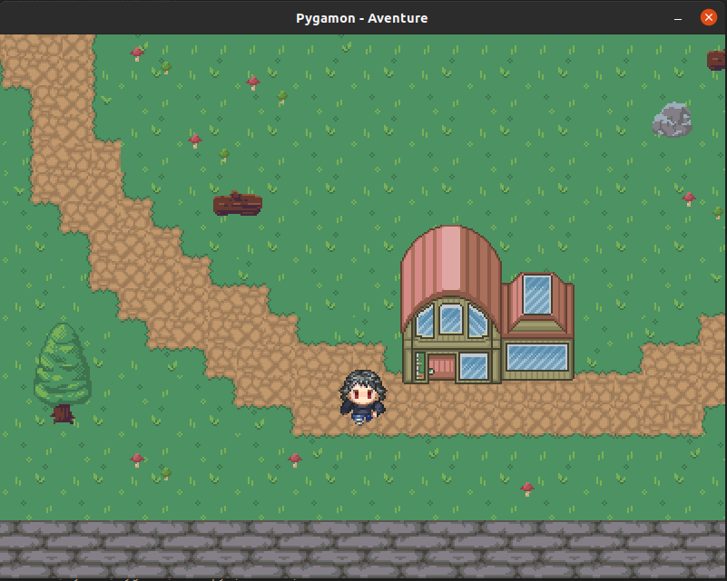

# Pygamon

Small game inspired of Pokemon. In Python with pygame. For learn.




***

## How to install ?

- clone the repo:
  - in ssh : ```git clone git@github.com:Erwann-M/Pygamon.git```
  - in HTTPS : ```git clone https://github.com/Erwann-M/Pygamon.git```
- [install python](https://www.python.org/downloads/)
- install all packages required:
  - pygame: ```pip install pygame```
  - pytmx: ```pip install pytmx```
  - pyscroll: ```pip install pyscroll```
- Go in pygamon folder: ```cd pygamon```
- start game: ```python3 main.py```
  
Enjoy !!!
